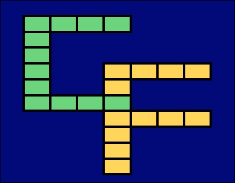

# CausalFan 

Code associated with Sports Analytics [blog](https://causalfan.substack.com/). The focus so far has been on the Suncorp Super Netball league and the Australian Netball Diamonds. I have at times ventured into other sports, like the WNBL and the AFL.

## Table of contents

1.  [Fetch data files](R/fetch_data.R): Fetch netball stats for given season/round.
2.  [Process data files](R/process_data.R): Process extracted data
3.  [Load data files](R/load_netball_data.R): Load data files for selected season.
4.  [Shared experience](R/shared_experience.R): Code for post on [shared experience](https://causalfan.substack.com/p/is-like-life-netball-all-about-connections)
5.  [Game day evaluation](R/game_day.R): Template for several of the usual game day evaluation metrics (offensive/defensive rating, scoring graphs)
6.  [Feeding efficiency](R/feed_efficiency.R): Comparison graphs for who the most efficient feeder were in the last 10 years, by position.
7.  [2022 player signings](R/2022_draft_season.R)
8.  [2022 season schedule](R/2022_schedule.R)
